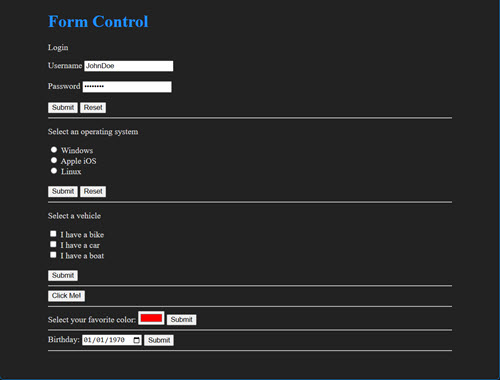

# Form Control
I'm pushing through the last few section of the W3schools curriculum for HTML. I already
completed the free Codecademy material on HTML and found the material on Forms to be lacking.
Now that I am going through W3schools' material, I'm finding the same shortcomings.
- there are tons of them and they all have a bunch of similar attributes and they all generally look similar, so it's all hard to retain
- they aren't very useful as they generally initiate database behavior which is beyond 
just about everyone who is learning HTML
- when I started to learn javascript, they don't really show me how to use these cool ways to input data offered by forms, for my javascript practice programs  
## Objective
**So this is a project dedicated to studying HTML forms by making javascript functions that
grab the information from the form and output something back to the page.**  

It's going to take a lot longer to finish up these W3schools HTML sections, but I will feel much better about the material.
## Procedures and Methods
1. I take an input form from ['HTML Input Types'](https://www.w3schools.com/html/html_form_input_types.asp) on W3schools.com, and put it in my own .html file that I've linked to a style.css and a script.js file.
2. I ask github copilot how to create javascript code that obtains the form's values, and it has generally chosen a great method that involves adding an event listener that waits for a 'submit' event. Then, default behavior of the form is interrupted and form data as well as the DOM in general is available for javascript manipulation.
3. I take the input information and then output something back to the web page to indicate success in control of input and output.
4. then I document...
## Topics
- textbox w/ password
- radio buttons
- checkboxes
- button
- color selector
- date

## Site View
