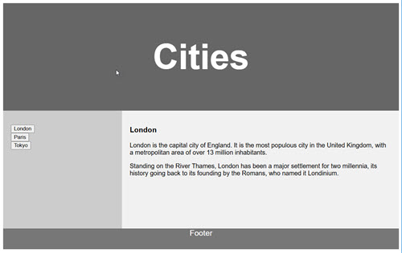
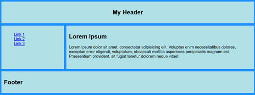
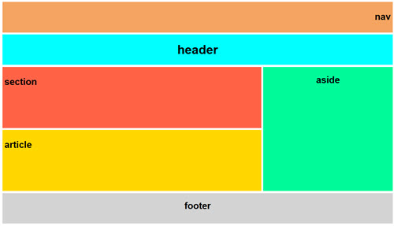
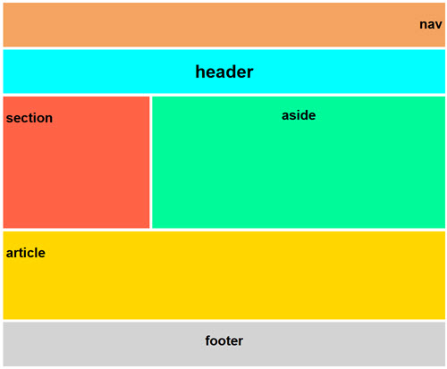
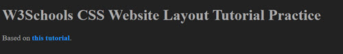
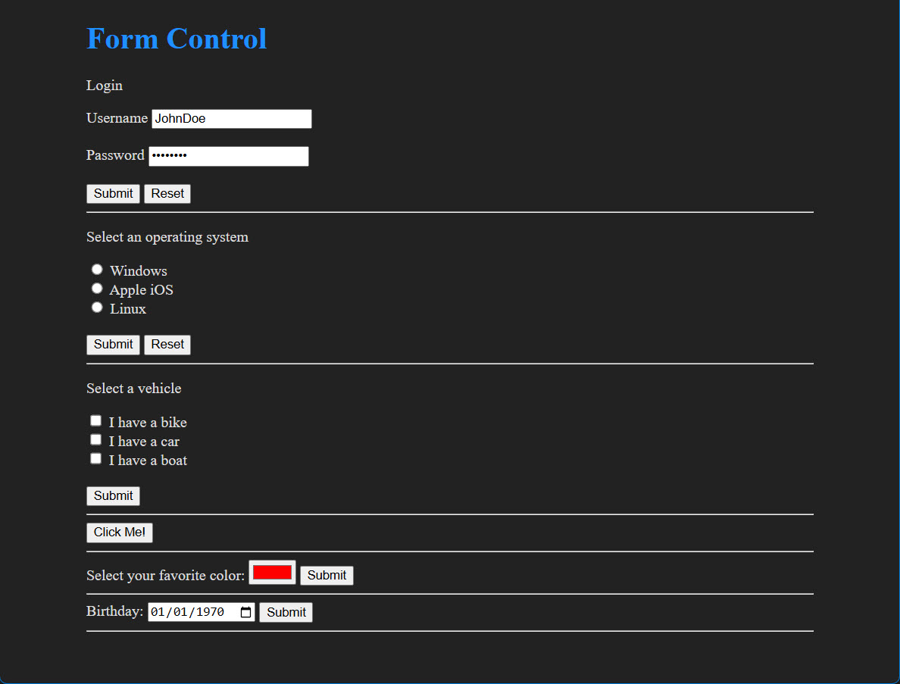

# Layout-Practice
A place to build some scaffolding, i.e. where HTML, CSS and JavaScript come
together in a flurry of crazy experiments with floats, position, grids, forms, etc.,
in order to prepare for the transition to frameworks.

## CSS Float 

## Simple-Grid-Layout-1

## Semantic-Grid-Layout-1

## Semantic-Grid-Layout-2

## W3SchoolsLayout

## Forms
